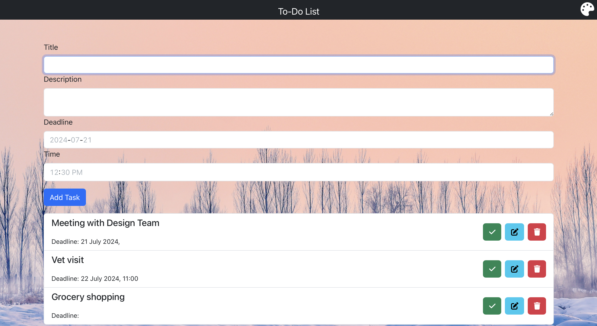

# To-Do List Application

## Overview

This To-Do List Application is designed to help users manage their tasks efficiently. Built using React and React-Bootstrap, this project demonstrates the core concepts of React and provides a user-friendly interface for task management. The application allows users to create, edit, complete, and delete tasks, with an optional description and deadline for each task.

[Live Demo](https://sankeerthini.github.io/To-Do-List-Application/)

## Features

### Task Management
- **Create Tasks**: Users can add new tasks with a title, optional description, and optional deadline.
- **Edit Tasks**: Users can edit the title, description, and deadline of existing tasks.
- **Complete Tasks**: Tasks can be marked as complete, and completed tasks are visually distinguished with a strikethrough title.
- **Delete Tasks**: Tasks can be deleted by clicking on them, and deleted tasks are removed from the list.

### Task Display
- **Ordered by Deadline**: Tasks are displayed in chronological order based on their deadlines.
- **Background Customization**: Users can customize the background for a personalized experience.

## Technologies Used
- **React**: A JavaScript library for building user interfaces.
- **React-Bootstrap**: A library of reusable front-end components that are easy to use and integrate with React.

## Usage

1. **Add a New Task**: Enter the task title, optional description, and optional deadline, then click "Add Task".
2. **Edit a Task**: Click on the edit icon next to the task and update the details.
3. **Complete a Task**: Click on the checkbox next to the task to mark it as complete.
4. **Delete a Task**: Click on the delete icon next to the task to remove it.
5. **Customize Background**: Use the background customization feature to personalize the app's appearance.

## Skills Demonstrated
- **HTML**: Structuring the application layout.
- **CSS**: Styling the application with React-Bootstrap.
- **JavaScript**: Implementing functionality and interactivity.
- **React**: Building reusable components and managing application state.

Feel free to reach out if you have any questions or suggestions for improvement. Happy coding!
